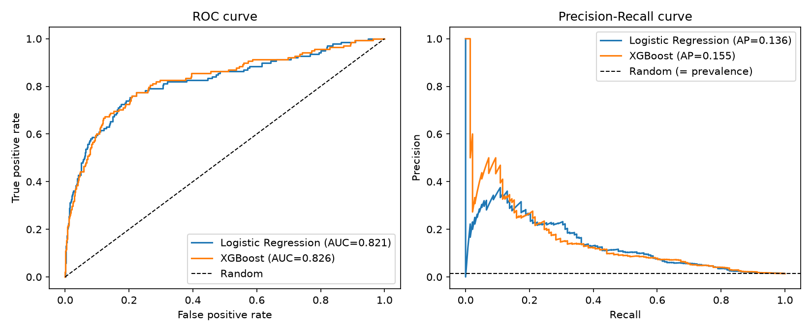
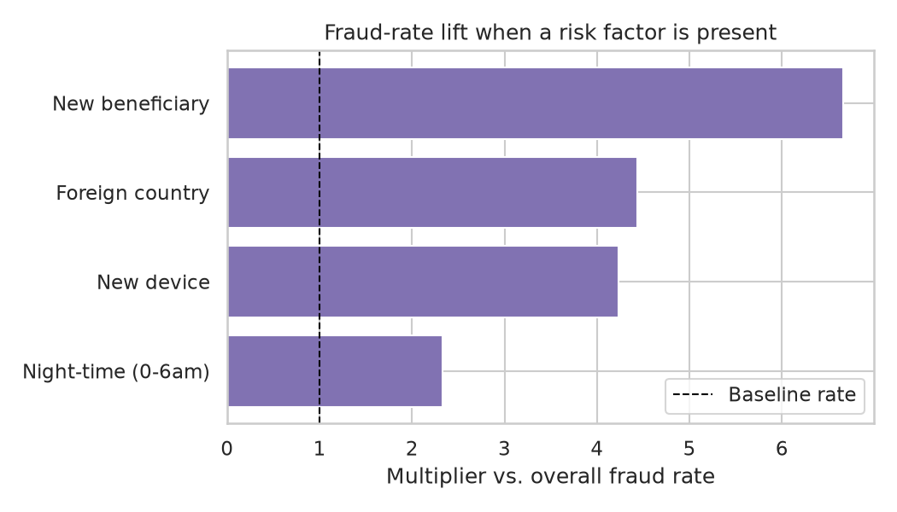

# BankShield AI

BankShield AI is a portfolio project demonstrating production-style AI engineering
across financial crime detection, cybersecurity, and applied ML. It is being built
in phases, each one a complete, working slice rather than a stub.

**This repository currently implements Phase 1 only.**

## Phase 1: fraud-detection ML baseline

A clean, honest baseline: synthetic banking transaction data, careful feature
engineering, a leakage-safe train/test split, two classifiers (Logistic
Regression and XGBoost), and evaluation metrics chosen for a rare-event
classification problem rather than misleading accuracy.

No AWS, no LLMs, no RAG, no agents, no frontend, no cyber-telemetry yet —
those are later phases, and this project is deliberately structured so they
can be added without reworking Phase 1 (see [Roadmap](#roadmap)).

### What's in the data

`scripts/01_generate_data.py` generates ~50,000 synthetic transactions across
8,000 customers over a 120-day window (`src/bankshield/data_generation.py`).
Fraud is rare (~1.5%) and generated as a **two-stage process**:

1. Behavioural features (device used, transaction country, hour, amount,
   category, ...) are drawn from realistic population-level base rates that
   do not depend on the eventual label.
2. A fraud probability is then computed from those realized features via a
   logistic combination of risk signals — including a few genuine
   **interaction effects** (e.g. a new device used at night, or a
   cross-border transfer into a high-risk category, are riskier together
   than the sum of their individual effects) — plus Gaussian noise, and the
   label is sampled from that probability.

This makes fraud **statistically distinguishable but not trivially
separable**: every risk factor raises the fraud rate, but none of them
comes close to perfectly predicting it (verified in `tests/`).

| Field | Description |
|---|---|
| `transaction_id`, `customer_id` | identifiers |
| `timestamp` | when the transaction occurred |
| `amount` | transaction amount, category- and customer-dependent |
| `merchant_category` | e.g. grocery, travel, wire_transfer, crypto_exchange |
| `home_country`, `country`, `country_mismatch` | customer's home country vs. where the transaction happened |
| `device_id`, `new_device` | device used, and whether it's new for this customer |
| `ip_address` | transaction IP |
| `account_age_days` | age of the account at transaction time |
| `transaction_velocity_24h` | this customer's transaction count in the trailing 24h |
| `new_beneficiary` | whether a transfer/withdrawal target is new for this customer |
| `hour_of_day`, `day_of_week`, `is_night` | timing features |
| `amount_to_avg_ratio` | this transaction's amount vs. the customer's own prior average |
| `is_fraud` | target label |

Every one of these engineered features (`new_device`, `transaction_velocity_24h`,
`amount_to_avg_ratio`, ...) is computed **causally**: by walking each
customer's transactions in timestamp order and only looking at that
customer's own past. No feature ever depends on information that wouldn't
be available at the moment the transaction occurred — the first place
leakage could otherwise be introduced.

### Pipeline

```
python -m venv .venv && source .venv/bin/activate
pip install -r requirements.txt

python scripts/run_all.py          # runs steps 1-6 below in order
```

Or step by step:

| Step | Script | What it does |
|---|---|---|
| 1 | `scripts/01_generate_data.py` | Generate synthetic transactions → `data/raw/transactions.csv` |
| 2 | `scripts/02_run_eda.py` | Exploratory analysis → `reports/figures/`, `reports/eda_summary.md` |
| 3 | `scripts/03_split_data.py` | Chronological train/test split → `data/processed/` |
| 4 | `scripts/04_train_baseline.py` | Train + evaluate Logistic Regression → `models/baseline_logreg_pipeline.joblib` |
| 5 | `scripts/05_train_xgboost.py` | Train + evaluate XGBoost → `models/xgboost_pipeline.joblib` |
| 6 | `scripts/06_compare_models.py` | Compare both models → `reports/model_comparison.md` |

Run the test suite (data-generation and split sanity checks) with:

```
pip install -r requirements-dev.txt
pytest tests/
```

### Splitting without leakage

The train/test split is **chronological**, not a random shuffle: the
earliest 80% of transactions (by timestamp) train the model, the most
recent 20% test it. A random shuffle would let a customer's March
transaction sit in the training set while their February transaction sits
in the test set — implicitly letting the model see "the future" relative to
what it's being tested on. In production a fraud model only ever scores
transactions that happened after everything it was trained on, so the
evaluation should reflect that. It also means the same customer can
legitimately appear in both splits (their early transactions train, their
later ones test) — what never happens is the same *transaction* appearing
in both.

### Results

Test set: 10,000 transactions, 1.38% fraud prevalence.

| Model | Accuracy | Precision | Recall | F1 | ROC-AUC | PR-AUC |
|---|---|---|---|---|---|---|
| Logistic Regression (baseline) | 0.828 | 0.055 | 0.710 | 0.102 | 0.821 | 0.136 |
| XGBoost | 0.979 | 0.229 | 0.217 | 0.223 | **0.826** | **0.155** |

(Exact numbers regenerate identically on re-run — the whole pipeline is
seeded. Current values are also saved in `reports/metrics/*.json`.)

XGBoost modestly outperforms the linear baseline on both threshold-independent
metrics (ROC-AUC, PR-AUC), consistent with the data containing real
non-additive interaction effects that a linear model can only approximate.
The two models sit at very different points on the precision/recall
trade-off at their default decision threshold: `class_weight="balanced"`
pushes the logistic regression to catch 71% of fraud at the cost of very
low precision (5.5% — 1,678 false alarms to catch 98 fraud cases), while
XGBoost's more moderate `scale_pos_weight` trades some recall for far fewer
false positives. Neither is "more correct" in the abstract — the right
operating point is a business decision (cost of a missed fraud vs. cost of
a false alarm), which is why this project reports the full metric suite
and the PR/ROC curves (`reports/figures/roc_pr_comparison.png`) instead of
picking one number and one threshold.



### Why accuracy alone is misleading

Fraud is rare: only 1.38% of test transactions are fraudulent. A model that
predicts "legitimate" for every single transaction — catching zero fraud —
would score **98.62% accuracy**, beating both real models trained here on
that metric alone. Accuracy weighs every prediction equally, so under this
much class imbalance it's almost entirely determined by performance on the
uninteresting 98.6% majority class. That's why this project always reports:

- **Precision** — of the transactions flagged, how many were actually fraud
  (controls false-alarm cost: blocked legitimate customers, review workload).
- **Recall** — of the actual fraud, how much was caught (the number a bank
  cares about most when limiting losses).
- **F1** — the harmonic mean of the two, useful when there's no single
  dominant business cost.
- **ROC-AUC** — ranking quality across all thresholds, but can look
  artificially strong under heavy imbalance since the false positive *rate*
  stays low even when false positives significantly outnumber true
  positives in absolute count.
- **PR-AUC** — the more honest summary metric here: a random classifier's
  PR-AUC baseline equals the fraud prevalence itself (~1.4%, not 0.5), so it
  directly reflects how hard the imbalance makes precision to achieve.
- **Confusion matrix** — the actual counts behind all of the above.

Full write-up with worked numbers: [`reports/model_comparison.md`](reports/model_comparison.md).

### Exploratory analysis

See [`reports/eda_summary.md`](reports/eda_summary.md) and `reports/figures/`
for class balance, amount distributions, fraud rate by hour/category, and
risk-factor lift (e.g. transactions with a new beneficiary are ~6-7x more
likely to be fraud than the baseline rate).



### Project structure

```
bankshield-ai/
├── src/bankshield/          # importable package — the actual logic
│   ├── config.py            # paths, column lists, run parameters
│   ├── data_generation.py   # synthetic transaction generator
│   ├── features.py          # train/test split + preprocessing pipeline
│   ├── modeling.py          # model definitions (LogReg, XGBoost)
│   ├── evaluation.py        # metrics, confusion matrix, PR/ROC plots
│   └── eda.py                # exploratory analysis plots
├── scripts/                 # thin, numbered, run-in-order entry points
├── tests/                   # data-generation and split sanity checks
├── data/{raw,processed}/    # generated CSVs (gitignored, regenerate via scripts)
├── models/                  # saved joblib pipelines (gitignored, regenerate via scripts)
└── reports/{figures,metrics}/  # EDA + evaluation outputs (versioned)
```

Preprocessing (`StandardScaler` + `OneHotEncoder`) lives inside the same
`sklearn.Pipeline` as each classifier, so `models/*.joblib` is a single
self-contained artifact — load it and call `.predict()` on a raw feature
DataFrame, no separate preprocessing step to keep in sync.

`src/bankshield`'s module boundaries (`data`, `features`, `modeling`,
`evaluation`) are intentionally where later phases will plug in — new data
sources feed `data`, new engineered signals feed `features`, new model
types feed `modeling` — without needing to restructure what's already here.

## Roadmap

Phase 1 (this repo) is the classical ML foundation. Planned next:

- **Phase 2** — cyber-login telemetry (device/session/auth signals) fused
  with transaction features.
- **Phase 3** — graph-based fraud detection (shared devices/beneficiaries
  across customers, ring detection).
- **Phase 4** — AWS deployment (SageMaker/Lambda serving), Bedrock, RAG over
  fraud policy/case documents, and agentic investigation workflows.
- **Phase 5** — AI-security testing of the resulting system (prompt
  injection, model evasion, adversarial robustness).

## License

Portfolio project — no license specified.
